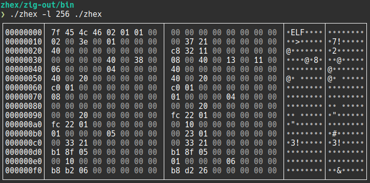

# zhex

This is a command-line hex-viewer written in the [Zig](https://ziglang.org/) programming language with version v0.11.0.

## arguments

```
> zhex --help
zhex [OPTIONS] FILE

OPTIONS:

   -l --length          <num>    Number of bytes read from the input.
                                 Default: [file-size]
                                 Examples: 8, 3kiB, 12kB or 0x55
   -o --offset          <num>    Number of bytes skiped in the input.
                                 Negative values will seek from the end of the file.
                                 Values can be specified in the same format than '--length'.
                                 Default: 0
   -b --block-size      <num>    Number of values in one block.
                                 Possible values: 1, 2, 4, 8, 16, 32
                                 Default: 8
   -n --blocks-per-line <num>    Number of blocks per line.
                                 Possible values: 1, 2, 3, 4, ..., 32
                                 Default: 2
   -v --value-size      <num>    Number of bytes per value.
                                 Possible values: 1, 2, 4, 8
                                 Default: 1
   -e --endianess       <E>      Defines the endianess of values.
                                 Possible values: little, big
                                 Default: little
   -B --no-borders               Do not show borders. Shown by default.
   -P --no-position              Do not show positions. Shown by default.
   -C --no-characters            Do not show characters. Shown by default.
      --no-color                 Disable colorization. Enabled by default.

   -v --version                  Show the version of the zhex binary.
   -h --help                     Show this output.
```

## preview



## todo

- [feature] command line parsing is not implemented yet (but the options are implemented in code - just change the Options-struct default values)
- [feature] option to highlight byte intervals
- [feature] custom colorization
- [fix] do not show empty blocks with one line outputs
